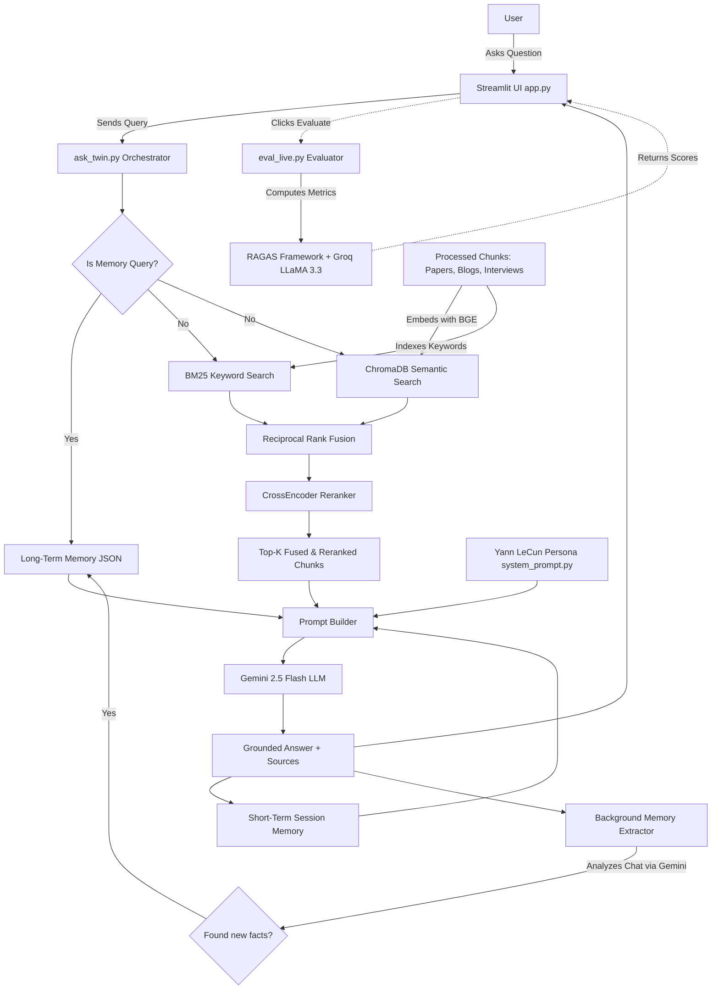

# Architecture Diagram

```mermaid
flowchart TD
    %% User and UI
    U[User] -->|Asks Question| UI[Streamlit UI app.py]
    
    %% Core Orchestration
    UI -->|Sends Query| Orchestrator[ask_twin.py Orchestrator]
    
    %% Live Evaluation (Optional)
    UI -.->|Clicks Evaluate| Eval[eval_live.py Evaluator]
    Eval -->|Computes Metrics| Ragas[RAGAS Framework + Groq LLaMA 3.3]
    Ragas -.->|Returns Scores| UI

    %% Memory Routing
    Orchestrator --> Router{Is Memory Query?}
    
    %% Memory Retrieval Branch
    Router -->|Yes| LTM[Long-Term Memory JSON]
    
    %% Retrieval Pipeline Branch
    Router -->|No| BM25[BM25 Keyword Search]
    Router -->|No| Vector[ChromaDB Semantic Search]
    
    %% Knowledge Base Ingestion (Offline)
    Corpus[Processed Chunks: Papers, Blogs, Interviews] -->|Embeds with BGE| Vector
    Corpus -->|Indexes Keywords| BM25
    
    %% Fusion and Reranking
    BM25 --> RRF[Reciprocal Rank Fusion]
    Vector --> RRF
    RRF --> Reranker[CrossEncoder Reranker]
    Reranker --> Context[Top-K Fused & Reranked Chunks]

    %% Prompt Assembly
    LTM --> Prompt[Prompt Builder]
    Context --> Prompt
    STM[Short-Term Session Memory] --> Prompt
    Persona[Yann LeCun Persona system_prompt.py] --> Prompt
    
    %% Generation
    Prompt --> Gemini[Gemini 2.5 Flash LLM]
    Gemini --> Answer[Grounded Answer + Sources]
    
    %% Response back to UI
    Answer --> UI
    Answer --> STM
    
    %% Background Memory Extraction
    Answer --> Extractor[Background Memory Extractor]
    Extractor -->|Analyzes Chat via Gemini| NewFacts{Found new facts?}
    NewFacts -->|Yes| LTM
```
